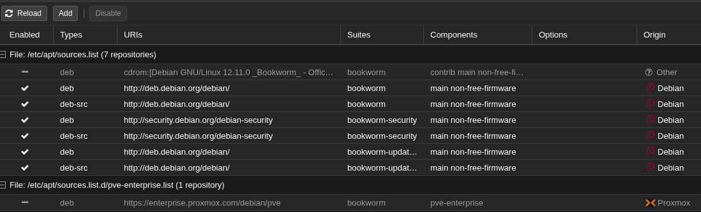

Installation de l'hyperviseur Proxmox par dessus une Debian 12.

Modification du fichier /etc/hosts

```
127.0.0.1       localhost
x.x.x.x       srv00.homelab.local     srv00

# The following lines are desirable for IPv6 capable hosts
::1     localhost ip6-localhost ip6-loopback
ff02::1 ip6-allnodes
ff02::2 ip6-allrouters

```

Ajout de l'adresse du serveur dans le fichier /etc/hosts de la machine de management

```
x.x.x.x       srv00.homelab.local     srv00
```


Ajout du dépôt de Proxmox VE au sources.list

```
echo "deb [arch=amd64] http://download.proxmox.com/debian/pve bookworm pve-no-subscription" > /etc/apt/sources.list.d/pve-install-repo.list
```

Ajout de la clé gpg du dépôt

```
wget https://enterprise.proxmox.com/debian/proxmox-release-bookworm.gpg -O /etc/apt/trusted.gpg.d/proxmox-release-bookworm.gpg
```

Mise à jour du dépôt et du système

```
apt update && apt full-upgrade
```

Installation du noyau Proxmox VE

```
apt install proxmox-default-kernel

systemctl reboot
```

Installation des packets Proxmox VE

```
apt install proxmox-ve postfix open-iscsi chrony
```

Suppression du noyau Debian

```
apt remove linux-image-amd64 'linux-image-6.1*'
```

Mise à jour de Grub2

```
update-grub
```

Désactivation du dépôt entreprise




# 19-02-2026

## Accès à distance via Tailscale

```
curl -fsSL https://tailscale.com/install.sh | sh

tailscale up
```

