# 03-02-2026

## Installation de pfSense 2.7.2

Déploiement d'une machine pfSense avec les spécifications suivantes :

- CPU : 1 vCPU 2 Cores
- RAM : 2 GB
- Hard drive : SATA 32Go
- vNIC : vmbr0 (WAN) - vmbr1 (Trunk)

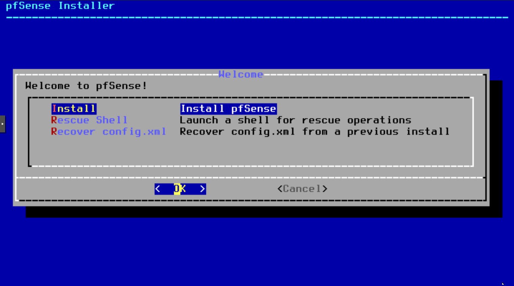
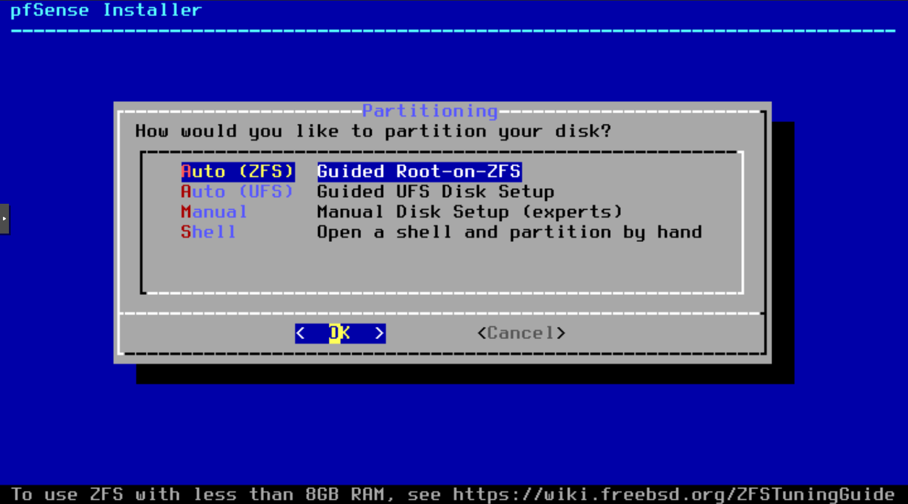
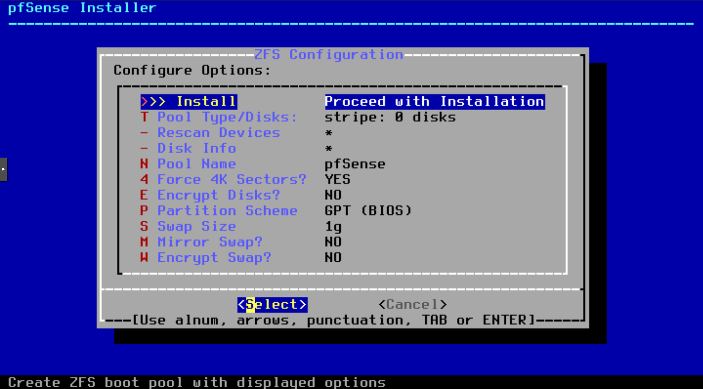
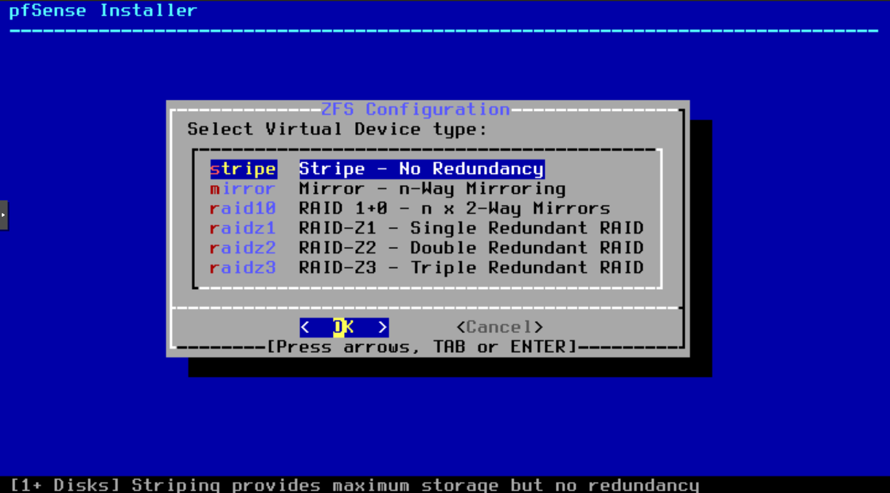
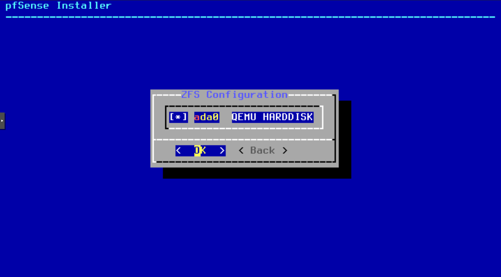
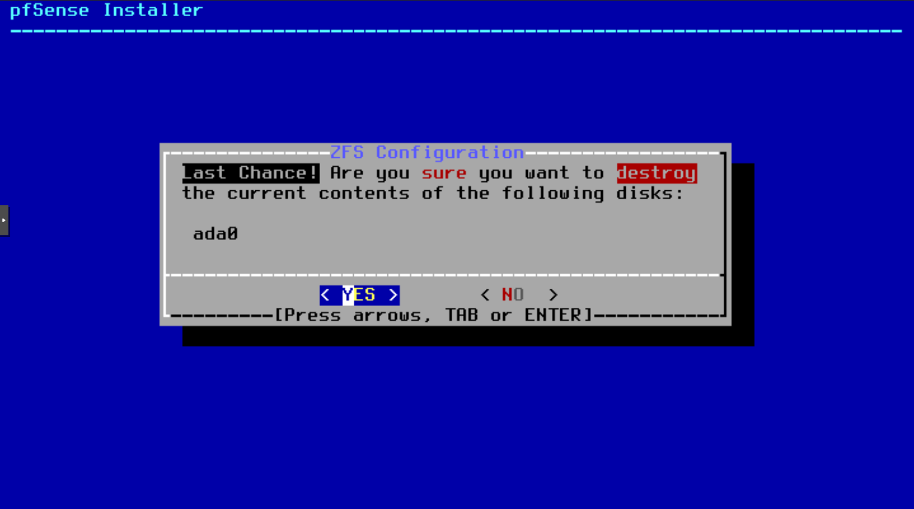

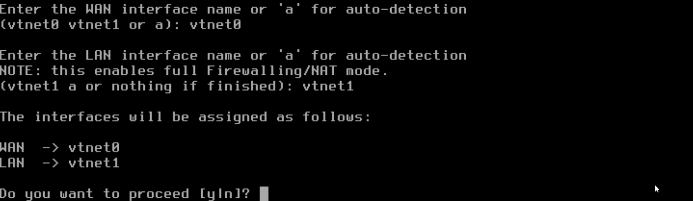
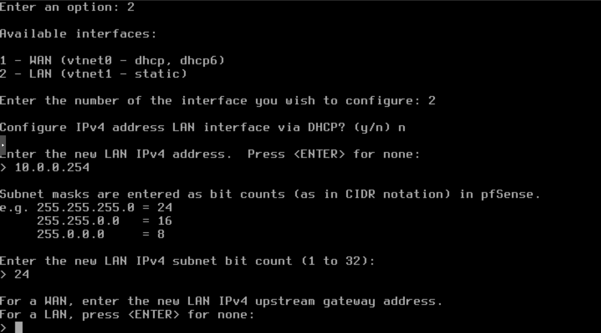
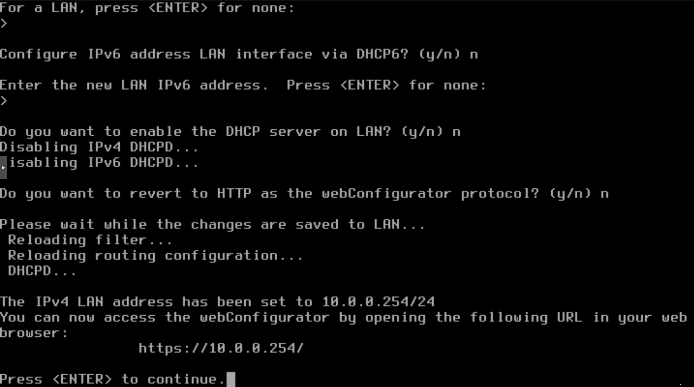
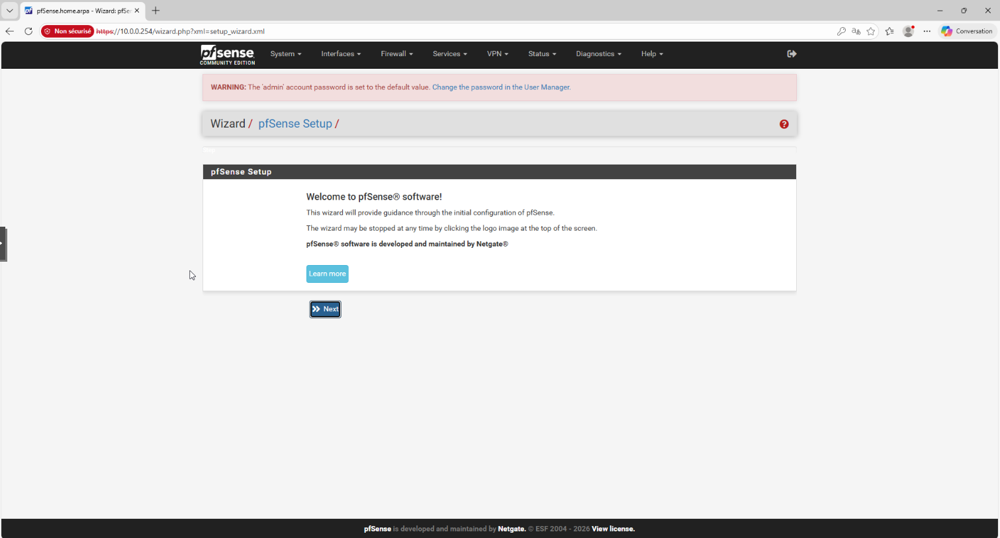
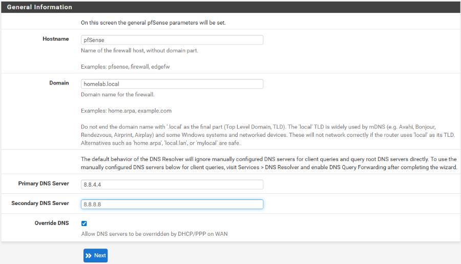
